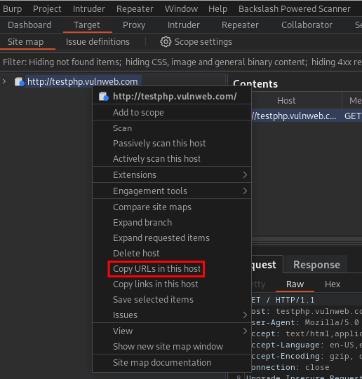

# SessionProbe 🚀⚡

`SessionProbe` is a multi-threaded pentesting tool designed to assist in evaluating user privileges in web applications. It takes a user's session token and checks for a list of URLs if access is possible, highlighting potential authorization issues. `SessionProbe` deduplicates URL lists and provides real-time logging and progress tracking.

`SessionProbe` is intended to be used with `Burp Suite's` "Copy URLs in this host" functionality in the `Target` tab. 



# Built-in Help 🆘

Help is built-in!

- `sessionprobe --help` - outputs the help.

# How to Use ⚙

```text
Usage:
    sessionprobe [flags]

Flags:
  -H, --headers string   HTTP headers to be used in the requests in the format "Key1:Value1;Key2:Value2;..."
  -h, --help             help for sessionprobe
  -o, --out string       output file (default: output.txt) (default "output.txt")
  -p, --proxy string     proxy URL (default: "")
  -t, --threads int      number of threads (default: 10) (default 10)
  -u, --urls string      file containing the URLs to be checked (required)

Examples:
    ./sessionprobe -u ./urls.txt --out ./unauthenticated-test.txt --threads 15
    ./sessionprobe -u ./urls.txt -H "Cookie: .AspNetCore.Cookies=<cookie>" -o ./output.txt
    ./sessionprobe -u ./urls.txt -H "Authorization: Bearer <token>" --proxy http://localhost:8080
```

# Setup ✅

- You can simply run this tool from source via `go run .` 
- You can build the tool yourself via `go build`

# Example Output 📋

```
Responses with Status Code: 200

https://<some-host>/<some-path> => Length: 12345
...

Responses with Status Code: 301

...

Responses with Status Code: 302

...

Responses with Status Code: 404

...

Responses with Status Code: 502

...

```

# Features 🔎 

- Test for authorization issues
- Automatically dedupes URLs
- Sorts the URLs by response status code and extension (e.g., `.css`, `.js`), and provides the length
- Multi-threaded
- Proxy functionality to pass all requests e.g. through `Burp`
- ...

# Bug Reports 🐞

If you find a bug, please file an Issue right here in GitHub, and I will try to resolve it in a timely manner.
